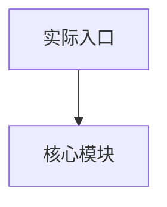

# Code To Docs 技能

## 概述

用于在文档预读后、以代码为最终依据，分目录生成或更新文档，并给出复用、重构边界、项目经历和面试表达总结。

**核心原则**：代码是唯一事实来源，现有文档仅用于初步理解、定位和格式对齐。文档描述与代码冲突时，以代码为准；代码中未体现的能力不能写成已落地能力。

## 事实来源与真实性边界

- 先阅读 README、docs、设计说明、接口文档、部署文档等材料，建立项目背景、业务场景、技术栈和运行方式的初步认知。
- 随后阅读实际代码，包括入口文件、核心模块、配置、Agent/LLM 调用、工具调用、数据处理、异常处理、日志、测试和部署相关文件。
- 输出结论时必须标注来源级别：`代码确认`、`文档线索`、`上下文推断`、`待确认`。
- 简历、STAR、面试表达中的工程化亮点必须区分：`代码已体现` 与 `可延展表达`。
- 不得编造确定数据。所有不确定指标使用 `[X]`、`[Y]`、`[占位符]`，并给出合理填写范围和估算依据。

## 工作流程

```
┌─────────────────────────────────────────────────────────────┐
│                    Code To Docs 工作流                       │
├─────────────────────────────────────────────────────────────┤
│                                                             │
│  0. 文档预读（只建上下文，不作为事实来源）                    │
│     ↓                                                       │
│  1. 应用忽略规则                                             │
│     ↓                                                       │
│  2. 建立代码清单 → 定位叶子目录                               │
│     ↓                                                       │
│  3. 叶子目录文档（自底向上）                                  │
│     ↓                                                       │
│  4. 上层目录汇总                                             │
│     ↓                                                       │
│  5. 顶层总结（结构/分层/依赖/复用/重构/架构图）               │
│     ↓                                                       │
│  6. 输出校验                                                 │
│                                                             │
└─────────────────────────────────────────────────────────────┘
```

### 步骤详解

| 步骤 | 动作 | 说明 |
|------|------|------|
| 0 | 文档预读 | 先读 README/docs 等文档，记录文档线索，后续必须用代码校验 |
| 1 | 应用忽略规则 | 直接应用默认忽略，用户明确要求时再调整 |
| 2 | 建立代码清单 | `rg --files` 获取文件，定位叶子目录 |
| 3 | 叶子目录文档 | 逐个读取，使用「叶子目录模板」 |
| 4 | 上层目录汇总 | 融合子目录结果，使用「上层目录模板」 |
| 5 | 顶层总结 | 全局结构、分层、依赖、复用、重构、架构图 |
| 6 | 输出校验 | 默认仅返回路径与说明；简历/STAR/架构图/面试材料按用户请求直接给核心内容 |

**叶子目录定义**：包含代码文件，且没有子目录包含代码文件。

## 默认忽略规则

### 忽略目录

```
.git/  node_modules/  dist/  build/  out/  coverage/
vendor/  .cache/  tmp/  logs/  .idea/  .vscode/
.next/  .nuxt/  target/  bin/  obj/
```

### 忽略文件

```
*.md          # README/docs 可先预读；不参与代码事实判定，旧文档与代码冲突时以代码为准
*.min.js      # 压缩文件（若为唯一源码再纳入）
*.map         # Source Map
```

## 文档落盘规则

| 情况 | 处理方式 |
|------|----------|
| 目录已有 `.md` | 选择最贴近目录用途的文档更新 |
| 没有现有文档 | 默认创建 `README.md` |
| 顶层文档 | 默认使用 `README.md` |
| 旧文档与代码冲突 | 以代码为准改写 |

## 文档模板

### 叶子目录模板

```markdown
# <目录名>（<相对路径>）

## 职责与边界
- <该目录负责的功能范围>
- <明确不负责的内容或依赖假设>

## 关键入口与导出
- 入口文件：<文件名/作用>
- 关键导出：<函数/类/模块>（简述作用）

## 主要流程/数据流
- <流程/调用链的关键步骤>
- <输入/输出与状态变化>

## 关键配置/常量
- <配置项/常量>：<用途与影响范围>

## 依赖关系
- 上游依赖：<依赖的模块/服务/第三方>
- 下游依赖：<被哪些模块调用>

## 复用与重构提示
- 可复用点：<可抽象的能力>
- 最小重构单元：<建议抽离的子模块与理由>
```

### 上层目录模板

```markdown
# <目录名>（<相对路径>）

## 目录职责
- <本层级提供的能力/聚合关系>

## 子模块清单
- <子目录1>：<一句话职责>
- <子目录2>：<一句话职责>

## 上层入口与组合关系
- 入口文件：<文件名/作用>
- 组合方式：<如何组织/调度子模块>

## 跨模块交互/依赖方向
- <关键依赖方向与边界>

## 关键配置
- <配置项/常量>：<用途>

## 风险或重构候选
- <耦合点/重复逻辑/技术债>
```

### 顶层总结模板

```markdown
# 项目总览

## 结构图
- <树状结构或分层列表>

## 模块分层与依赖方向
- <层级说明与依赖方向>

## 可复用模块清单
- <模块>：<复用理由/适用范围>

## 最小重构单元划分
- <单元>：<范围、边界、理由>

## 关键技术约束
- <运行时/平台/框架/构建链路限制>

## 后续建议
- <重构优先级/演进建议>
```

### 简历与面试附加模板（按需）

当用户明确提出「简历」「STAR」「项目经历」「面试」「项目包装」「AI 应用开发」「Agent 方向」时，在顶层总结之外额外输出以下内容：

````markdown
# 项目经历与面试准备

## 项目理解
- 项目名称：
- 项目类型：
- 业务场景：
- 目标用户：
- 核心问题：
- 技术栈：
- 真实存在的核心模块：
- 适合包装方向：AI 应用开发 / Agent 工程 / 自动化系统 / 数据分析系统

## STAR 项目经历
### Situation
- <项目背景、业务痛点、技术挑战>

### Task
- <我承担的具体责任>

### Action
- <基于代码事实的技术动作>
- <可延展表达需单独标注，不能混同为已实现>

### Result
- <使用 [X]、[Y] 形式的量化占位符>
- <每个指标给出合理填写范围和估算依据>

## 简历 Bullet
- 精简版：4-6 条，可直接放入简历
- 偏高级包装版：突出系统设计、Agent 编排、工程化、业务结果
- 保守真实版：严格基于代码事实
- 面试讲述版：1-2 分钟口述，自然引导追问

## AI / Agent 工程化亮点
| 亮点 | 代码证据 | 确定性 | 简历表达 | 面试边界 |
|------|----------|--------|----------|----------|
| <Agent 任务拆解/工具调用/Prompt/结构化输出/异常兜底/重试/日志等> | <文件路径+行号> | 代码已体现/可延展表达 | <表达> | <不能说太绝对的点> |

## 架构图


## 面试追问与答案
- Q：<技术架构/Agent 设计/Prompt/工具调用/异常兜底/数据准确性/性能/稳定性/个人贡献等>
- A：<真实候选人口吻；已实现与后续优化分开讲>

## 真实性边界
- 代码明确实现：
- 基于代码合理推断：
- 简历包装表达：
- 面试不能说太绝对：
- 必须补真实数据：
- 深挖前需要补强：
````

## 复用与重构判断准则

### 模块边界判断

| 原则 | 说明 |
|------|------|
| 运行时边界 | 前端/后端、content/background/popup 等 |
| 业务域边界 | 同一业务流程/领域逻辑尽量聚合 |
| 依赖方向 | 稳定依赖不应反向引用不稳定模块 |
| 层级边界 | UI 层不直接访问底层，需经服务/适配层 |

### 可复用模块特征

```
✅ 清晰输入/输出，接口稳定，副作用可控
✅ 外部依赖少，配置驱动，适配多场景
✅ 与具体业务/页面解耦，命名语义抽象
✅ 可通过测试或示例说明其行为
```

### 最小重构单元划分

```
✅ 满足「共同变更」原则：这些文件通常一起修改
✅ 对外接口清晰：可通过单一入口调用或替换
✅ 内部高内聚、外部低耦合：减少跨目录双向依赖
✅ 无隐式共享状态：避免全局变量或隐式副作用
```

### 快速判定清单

**可复用判定**
- [ ] 是否存在稳定 API/导出？
- [ ] 是否可以脱离当前目录单独使用？
- [ ] 是否能被多个上层模块调用？

**可独立重构判定**
- [ ] 是否能在不修改上层调用的前提下替换实现？
- [ ] 是否能明确划定文件范围与依赖边界？
- [ ] 是否不存在跨目录循环依赖？

## 使用示例

### 触发场景

```
用户请求                          触发技能
──────────────────────────────────────────
"帮我整理这个项目的文档"          → code-to-docs
"从代码刷新 README"               → code-to-docs
"分析一下代码结构"                → code-to-docs
"哪些模块可以复用"                → code-to-docs
"帮我做模块拆分建议"              → code-to-docs
"帮我把项目写进简历"              → code-to-docs + 简历与面试附加模板
"用 STAR 法则改写项目经历"        → code-to-docs + 简历与面试附加模板
"画出项目架构图"                  → code-to-docs + Mermaid 架构图
"包装 AI/Agent 方向项目亮点"      → code-to-docs + AI/Agent 工程化亮点
```

### 执行命令

```bash
# 获取代码文件清单
rg --files --glob '!node_modules' --glob '!dist' --glob '!*.md'

# 查找叶子目录
find . -type d -exec sh -c 'ls "$1"/*.{js,ts,py} 2>/dev/null | head -1' _ {} \;
```

## 注意事项

1. **大型仓库**：先分层处理，叶子目录优先，避免一次性加载过多文件
2. **测试/脚本目录**：如需纳入，需显式放开忽略规则
3. **不确定项**：记录为「假设/备注」随结果说明，不阻塞执行
4. **文档冲突**：始终以代码为准，旧文档仅参考格式
5. **简历包装**：允许偏高级表达，但必须保留真实性边界；未实现能力只能写为「可延展表达」或「后续可优化」
6. **量化结果**：不得写死虚假数据，只能给占位符、合理范围和估算依据
7. **架构图**：只画代码真实存在的模块；合理延展组件必须用虚线或标注「可扩展」

## 输出规范

- 默认仅返回新增/更新的 `.md` 路径与简要说明
- 不输出文档全文，除非用户明确要求，或用户请求的是简历/STAR/架构图/面试材料等需要直接阅读的交付内容
- 简历/STAR/面试输出必须直接给出核心内容，并可同时说明落盘文档路径
- 标记假设与备注
